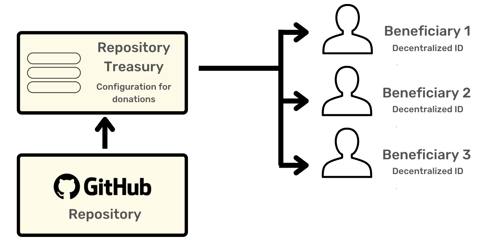

# Git Fund
[](https://app.promise.xyz/#/send?recipient=lukas&amount=1) 

## Getting Started

Our goal: provide creators of open source software a way to be compensated for their work - especially when used in production cases.

A large part of OSS remains underfunded, with no clear way to provide incentives for contributors..

**This demo utilizes Promise Pay to provide a way for programmatic payments, donations, and incentives to be set up within the open source community.** Promise Pay uses a unique web2 and web3 architecture which allows for feeless, programmatic transactions.

We unlock funding at the repository layer, and provide a mechanism for splitting payments across multiple team contributors automaticlaly.

## Features
    1. 'Fund' button in readme
    2. Payments on build/deploy
    3. CLI tool for payments
    3. Support for contributor splitting and recursion

[]    

## Payments Splitting
Our CLI tool expects a new file **fund.yml** in the root directory of the repository. This file describes how to manage a repository's incoming funds.

The fund.yml file has the following structure
   - allocations - an array of Promise Pay users, identifiable either via their decentralized ID or their linked github username. Allocations may be other github repositories (with their own fund.yml files) allowing for recursion in payments
   - treasury - A unique decentralized ID representing the repository itself. This decentralized ID may 

```
treasury:
    rooturl:  https://github.com/schulte-lukas/fund-demo
allocations:
    - promiseUsername: lukas
      percentage: 20.0
    - promiseUsername: Wolfram
      percentage: 80.0
```
## Limitations
- The minimum fundable amount is $0.01
- There is no set order in which payments are made. That means that all users listed in 'allocations' have an equivalent chance of receiving the last cent


